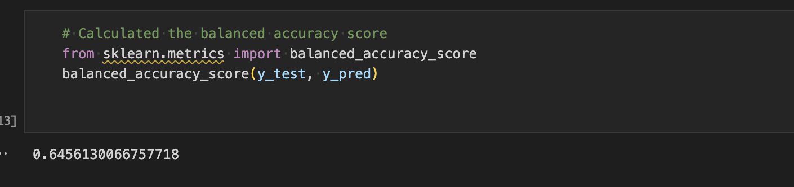
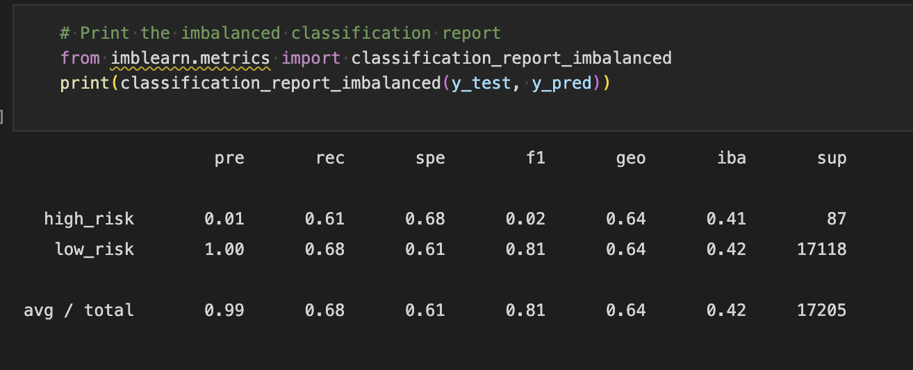
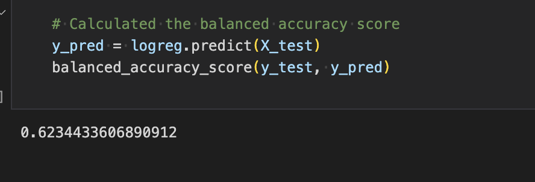
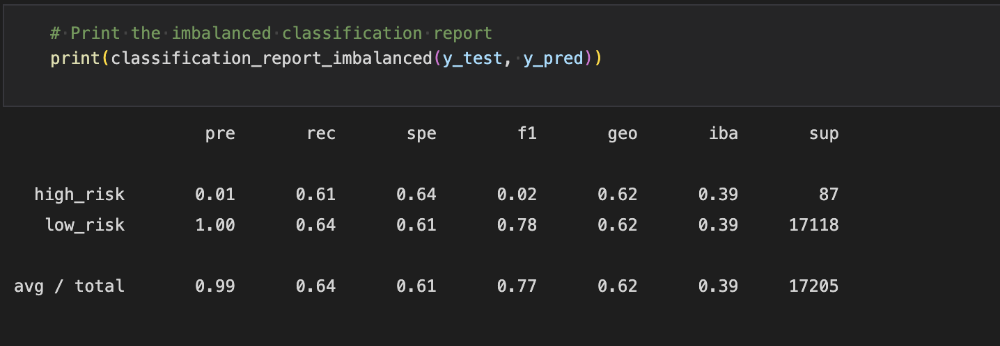
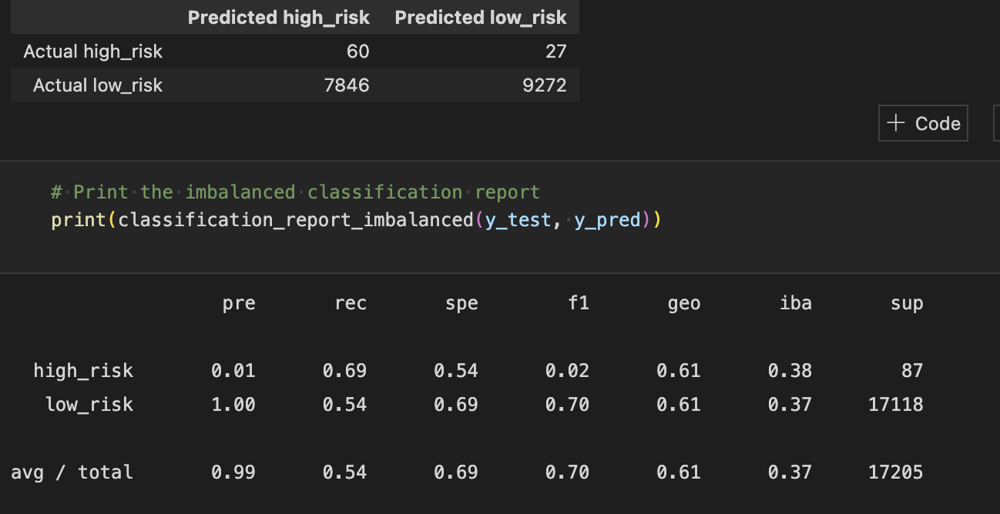
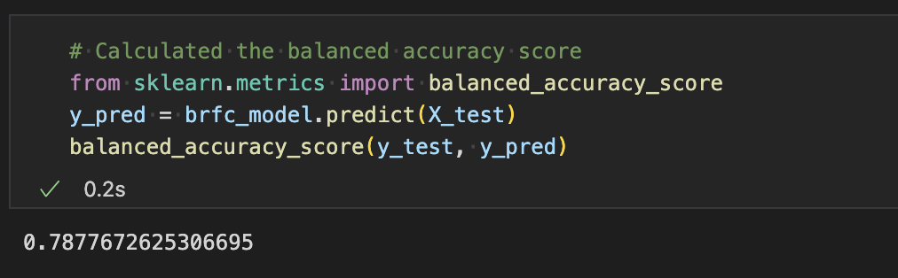
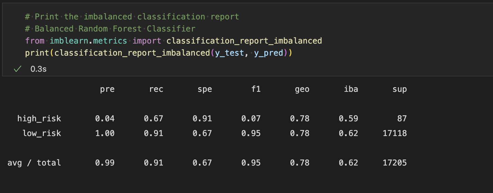
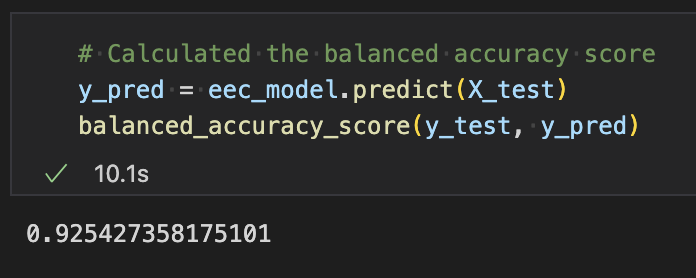
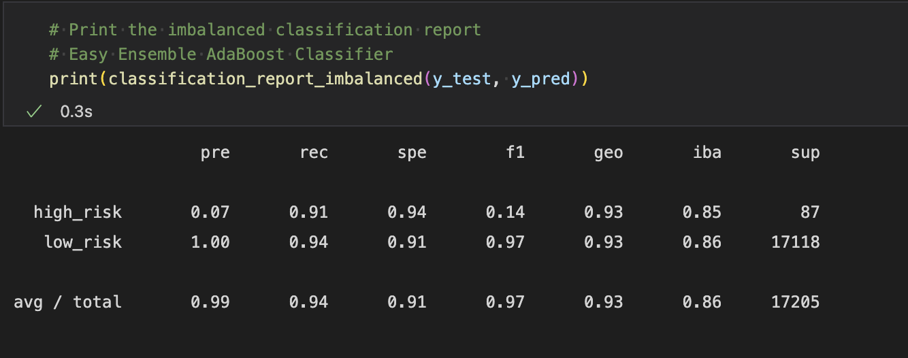

# Credit_Risk_Analysis

## Analysis Overview

In this project, we use Python to build and evaluate several machine learning models to predict credit risk.
We adopted the following procedure:
- oversample the data using the RandomOverSampler and SMOTE algorithms.
- Undersample the data using the ClusterCentroids algorithm.
- Use a combinatorial approach of over- and undersampling using the SMOTEENN algorithm.
- Compare two machine learning models that reduce bias, BalancedRandomForestClassifier and EasyEnsembleClassifier.
We will evaluate the performance of these models and make a recommendation on whether they should be used to predict credit risk.

# Results

## RandomOverSampler model
</img>
</img>

The balanced accuracy score is 65%.  
The high_risk precision is about 1% only with 61% sensitivity which makes a F1 of 2% only.   
Due to the high number of the low_risk population, its precision is almost 100% with a sensitivity of 68%.

# SMOTE model
</img>
</img>

The balanced accuracy score is 62%.  
The high_risk precision is about 1% only with 61% sensitivity which makes a F1 of 2% only.  
Due to the high number of the low_risk population, its precision is almost 100% with a sensitivity of 64%.

## SMOTEEN model
</img>

The balanced accuracy score is about 61%.  
The high_risk precision is still 1% only with 69% sensitivity which makes a F1 of only 2%.  
Due to the high number of false positives, the low_risk sensitivity is 57%.

## BalancedRandomForestClassifier model
</img>
</img>

The balanced accuracy score improved to about 79%.  
The high_risk precision is still low at 4% only with 67% sensitivity which makes a F1 of only 7%.  
Due to a lower number of false positives, the low_risk sensitivity is now 91% with 100% precision.

## EasyEnsembleClassifier model
</img>
</img>

Now, the balanced accuracy score is high to about 93%.  
The high_risk precision is still low at 7% only with 91% sensitivity which makes a F1 of only 14%.  
Due to a lower number of false positives, the low_risk sensitivity is now 94% with 100% precision.

# Summary 
All the models used to perform the credit risk analysis show weak precision in determining if a credit risk is high. The Ensemble models brought a lot more improvement specially on the sensitivity of the high risk credits. The EasyEnsembleClassifier model shows a recall of 92% so it detects almost all high risk credit. On another hand, with a low precision, a lot of low risk credits are still falsely detected as high risk which would penalize the bank's credit strategy and infer on its revenue by missing those business opportunities.
